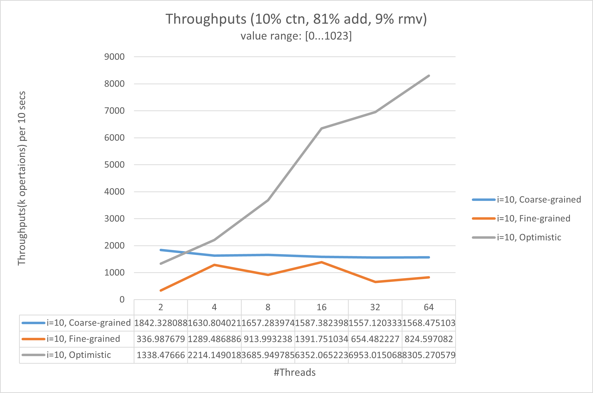
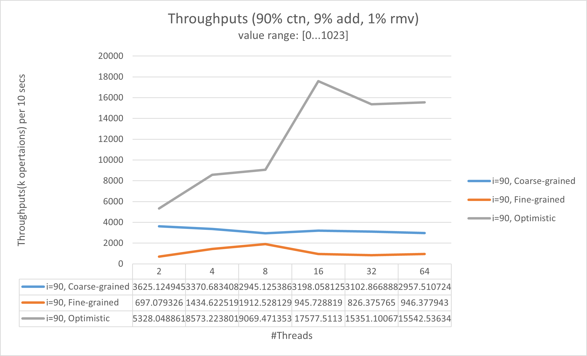

# 1DL590 Lab2 
Author: Haodong Zhao

***Note: All the experiments in this lab are done on Linus server `barany.it.uu.se`.***

## Task 1: Fine-grained synchronization
The concurrent list-based set with Fine-Grained synchronization is in the file named `Sets/FineList.cpp`.

## Task 2: Optimistic synchronization
The concurrent list-based set with Optimistic synchronization is in the file named `Sets/OptimisticList.cpp`.

## Task 3: Experiment
Compile and execute `T3Ex.cpp` on Linus server `barany.it.uu.se`.

**Compile:** `g++ T3Ex.cpp -lpthread -o t3.out`

**Execute:** `./t3.out`

### Results
The tables and curves can be found in the folder `Images`.

- When the values range from 0 to 7, we can see that the trends with different values of `i` are similar: The throughputs of all the three lists decrease with the threads increases. The Fine-grained List has the worst performance among the 3 lists with any tested number of threads. The Coarse-grained List is the best option in most cases.

    
    
    

- When the values range from 0 to 1023, we can see that the trends with different values of `i` are similar: The throughputs of all the three lists decrease with the threads increases. However, the Optimistic List gets better performance than the other 2 lists with more than 4 threads. The Fine-grained List has the worst performance among the 3 lists with any tested number of threads.

    
    
    

- The throughputs decrease remarkably if we add the range of inputs values from [0...7] to [0...1024]. The Optimistic List is the best choice when we have a large range of input values and considerable threads.

## Task 4: Multisets
The implemented multiset is in the file named `Sets/Multiset.cpp`. The process of the experiment is in the file named `T4Ex.cpp`.

Compile and execute `T4Ex.cpp` on Linus server `barany.it.uu.se`.

**Compile:** `g++ T4Ex.cpp -lpthread -o t4.out`

**Execute:** `./t4.out`