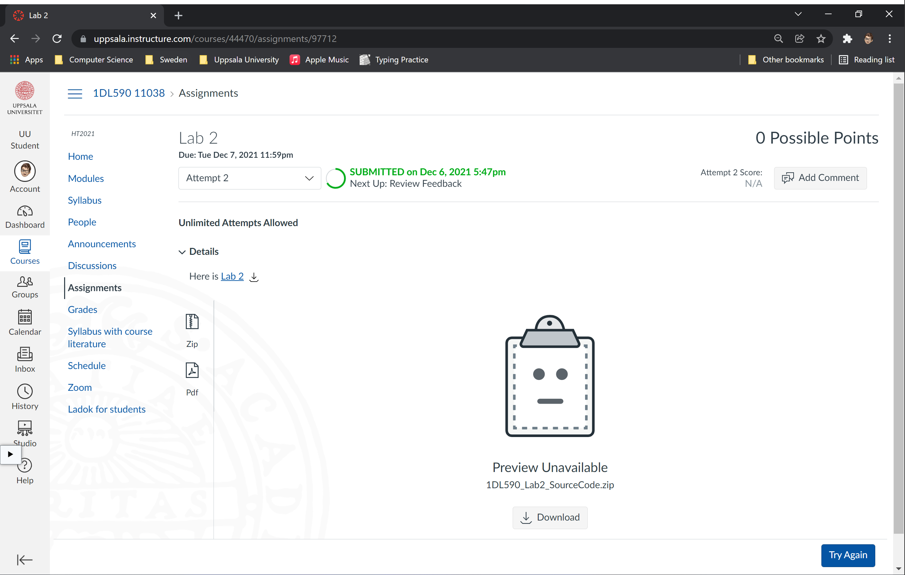

# 1DL590 Lab2 
Author: Haodong Zhao

## Sorry to resubmit late
When I reviewed my code today(2021.12.08), I find a bug in my code that may affect the result. I fix it successfully. However, the deadline is 2021.12.07. My last submission is on 12.06, you can see that on the screenshot below. I'm so sorry to be late, hope the resubmission will not affect my score. 😂😂😂

---
***Note: All the experiments in this lab are done on Linus server `barany.it.uu.se`.***

## Task 1: Fine-grained synchronization
The concurrent list-based set with Fine-Grained synchronization is in the file named `Sets/FineList.cpp`.

## Task 2: Optimistic synchronization
The concurrent list-based set with Optimistic synchronization is in the file named `Sets/OptimisticList.cpp`.

## Task 3: Experiment
Compile and execute `T3Ex.cpp` on Linus server `barany.it.uu.se`, which is a 16-core machine.

**Compile:** `g++ T3Ex.cpp -lpthread -o t3.out`

**Execute:** `./t3.out`

### Results
The tables and curves can be found in the folder `Images`.

- When the values range from 0 to 7, we can see that the trends with different values of `i` are similar: The throughputs of the optimistic list increase with the threads increase, while the throughputs of the fine-grained list and the optimistic list increases as the number of threads increases. On this 16-core CPU machine, the optimistic list shows its best performance with 16 threads in all the 3 different cases.

    
    
    

- When the values range from 0 to 1023, we can see that the trends with different values of `i` are similar: The throughputs of the optimistic list increase with the threads increase, while the throughputs of the fine-grained list and the optimistic list remained stable. In all the 3 cases, the fine-grained list shows the worst performance.

    
    
    

- The throughputs of all the 3 lists decrease remarkably if we add the range of inputs values from [0...7] to [0...1023]. The Optimistic List is the best choice when we have a large range of input values and considerable threads.

## Task 4: Multisets
The implemented multiset is in the file named `Sets/Multiset.cpp`. The process of the experiment is in the file named `T4Ex.cpp`.

Compile and execute `T4Ex.cpp` on Linus server `barany.it.uu.se`.

**Compile:** `g++ T4Ex.cpp -lpthread -o t4.out`

**Execute:** `./t4.out`