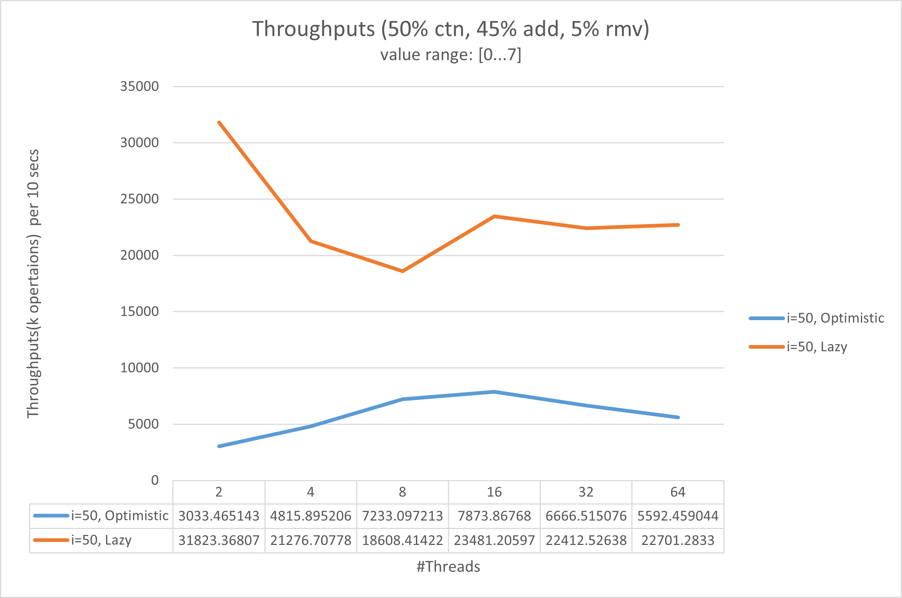

# 1DL590 Lab3
Author: Haodong Zhao

***Note: All the experiments in this lab are done on Linus server `barany.it.uu.se`.***

## Task 1: Lazy synchronization
The concurrent list-based set with Lazy synchronization is in the file named `Datastructures/LazyList.cpp`.

## Task 2: Experiment
Compile and execute `T2Ex.cpp` on Linus server `barany.it.uu.se`, which is a 16-core machine.

**Compile:** `g++ T2Ex.cpp -lpthread -o t2.out`

**Execute:** `./t2.out`

### Results
The tables and curves can be found in the folder `Images`.

- When the values range from ***0 to 7***, we can see that the trends with different values of `i` are similar: 
    - The throughputs of the lazy list decrease with the number of threads increasing when the threads are less than 8. And then its performance starts to increase until its performance to a peak when the number of threads is 16.
    - The throughputs of the optimistic list increase with the number of threads increase until the threads are more than 16. On this 16-core CPU machine, the optimistic list approaches its best performance with 16 threads in all the 3 different cases. 

    
    
    
    

    
    

- When the values range from ***0 to 1023***, we can see that the trends with different values of `i` are similar: 
    - The throughputs of the optimistic list and the lazy list decrease with the number of threads increasing until the threads are more than 16. 
    - On this 16-core CPU machine, they approach their best performance with 16 threads in all the 3 different cases. 

    
    
    

- Since the lazy list does not need locks in the `ctn` method, so more the percentage of the `ctn` method set, the better performance it will get.
- In all the cases,  the lazy list has better performance than the optimistic list.

## Task 3: The Extended Treiber Algorithm
The implemented Treiber Stack is in the file named `Datastructures/TreiberStack.cpp`. The process of the experiment is in the file named `T3Ex.cpp`.

Compile and execute `T3Ex.cpp` on Linus server `barany.it.uu.se`.

**Compile:** `g++ T3Ex.cpp -lpthread -o t3.out`

**Execute:** `./t3.out`